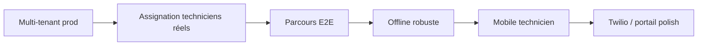

# Chantiers complexes — BELGMAP (PWA)

Document de référence sur les **plus gros travaux** à prévoir pour faire passer BELGMAP d’un prototype riche à une **PWA métier fiable en production**.

Dernière mise à jour : mai 2026.

**Plan d’exécution pas à pas** → [PLAN_STRATEGIQUE.md](./PLAN_STRATEGIQUE.md) · **Checklist prod** → [CHECKLIST_PRODUCTION.md](./CHECKLIST_PRODUCTION.md)

---

## Synthèse en une phrase

| Priorité | Chantier | Nature du travail |
|----------|----------|-------------------|
| **1** | Cycle métier **multi-tenant** de bout en bout | Large, transversal, risque sécurité / données |
| **2** | **Clôture terrain hors-ligne** + conflits | Algorithmique, edge cases réseau |
| **3** | **Hub technicien mobile-first** | Refonte UX / navigation majeure |
| **4** | Pipeline **Twilio + IA** | Intégrations + secrets + idempotence |
| **5** | **Portail client** (suivi + chat) | Auth + règles Firestore + temps réel |
| **6** | **Facturation auto** | Déjà amorcée (Cloud Functions) — dépend surtout des étapes avant |

---

## 1. Le plus gros chantier : cycle métier multi-tenant en production

Faire tourner de bout en bout, **en prod**, le parcours :

**Client (portail) → demande → back-office → assignation → technicien → clôture → facture**

…avec **isolation par société**, **rôles** (admin / collaborateur / technicien / client) et **règles Firestore cohérentes**.

### Ce qui existe déjà

- `firestore.rules` : `bmTenants`, portail client, chat IVANA, invites, validation rapport (`done` → `invoiced`).
- `CompanyWorkspaceContext`, `/api/company/sync-claims`, `/api/company/accept-invite`.
- Champ `companyId` sur les interventions, filtre tenant côté hooks.
- Assignation avec sélecteur dispatch (`TechnicianAssignPicker`, `rankTechniciansForIntervention`).
- Modules P0 testés : `technicianSchedule`, `assignInterventionToTechnician`, `technicianAssignmentsFilter`, `mapTechnicianMissions`.

### Ce qui rend le chantier difficile

| Dimension | État actuel | Travail restant |
|-----------|-------------|-----------------|
| **Sécurité** | Rules détaillées | Deux mondes : utilisateurs **portail société** (custom claims) vs autres profils ; règle simplifiée permettant encore la lecture globale des interventions pour certains comptes hors portail |
| **Auth / tenant** | Sync claims + memberships | Chaque persona doit avoir le bon token, la société active, et des requêtes Firestore qui **passent** les rules (souvent : écran vide = 1 requête refusée) |
| **Assignation** | UI dispatch | Lier chaque technicien Firestore à un **vrai `authUid`** (champ `Technician.authUid`), pas seulement `NEXT_PUBLIC_DEFAULT_ASSIGNED_TECHNICIAN_UID` |
| **Données** | Mode démo / staging preview | Bascule prod : `NEXT_PUBLIC_REAL_INTERVENTIONS_ONLY`, fin des seeds partagés (`mock-day-*`, `demo-tech-local`) |
| **Tests** | Jest unitaires sur modules critiques | **E2E** manquants : invite → login → demande → assign → accept → done → invoiced |

### Fichiers clés

- `firestore.rules`
- `src/context/CompanyWorkspaceContext.tsx`
- `src/app/api/company/sync-claims/route.ts`
- `src/app/api/company/accept-invite/route.ts`
- `src/features/interventions/assignInterventionToTechnician.ts`
- `src/features/backoffice/useBackOfficeInterventions.ts`
- `src/core/config/devUiPreview.ts`

### Critères de « terminé »

- [ ] Un admin crée une société, invite un collaborateur, les deux voient **uniquement** leurs dossiers.
- [ ] Un client portail crée une demande ; le back-office la voit ; assignation à un technicien **réel** ; le technicien accepte sur son hub.
- [ ] Clôture terrain → statut `done` → facture auto (`invoiced`) si checklist complète.
- [ ] Aucune fuite cross-tenant en lecture / écriture (audit rules + tests E2E).
- [ ] Parcours reproductible sur Vercel staging avec Firebase prod-like (voir `docs/SETUP_VERCEL_GITHUB.md`).

---

## 2. Le plus technique : clôture terrain hors-ligne

Gestion de la **file d’attente locale** (photos + signature), reprise au retour réseau, et **résolution de conflits** si le serveur a déjà marqué l’intervention terminée.

### Ce qui existe déjà

- `src/features/offline/completionSync.ts` — enqueue, flush, timeouts.
- `src/features/offline/completionConflict.ts` — comparaison remote vs file locale.
- `src/features/interventions/completionUploadCore.ts` — upload Storage + patch Firestore.
- `src/context/OfflineSyncContext.tsx` — toasts sync / conflit partiel.

### Ce qui rend le chantier difficile

- Bugs **non déterministes** : réseau lent, timeout 3–6 min, double clic, onglet en arrière-plan.
- Conflit **back-office vs terrain** (déjà partiellement géré ; UI utilisateur encore limitée).
- Tests difficiles (IndexedDB, `navigator.onLine`, Firebase Storage mock).

### Fichiers clés

- `src/features/offline/completionSync.ts`
- `src/features/offline/completionConflict.ts`
- `src/features/offline/completionQueueDb.ts`
- `src/features/interventions/components/TechnicianFinishJobPanel.tsx`

### Critères de « terminé »

- [ ] Clôture en mode avion → file visible → envoi auto au reconnect.
- [ ] Conflit explicite si le serveur est plus récent (message + action claire).
- [ ] Tests unitaires + au moins un scénario E2E « offline puis online ».

---

## 3. Le plus gros refactoring UX : hub technicien mobile-first

Aujourd’hui l’app est centrée sur un **carrousel 3 pages** (carte / hub société / hub technicien), pensé **bureau ou grande tablette**.

### Contraintes actuelles

- `src/features/app/DesktopOnlyGate.tsx` sur la page principale (`src/app/page.tsx`).
- Parcours terrain réparti entre hub technicien, bridge back-office, et route legacy `/technician`.
- Mapbox, caméra, signature : utilisables mais pas optimisés **téléphone en véhicule**.

### Travail à prévoir

- Navigation **mobile dédiée** (ou breakpoint tablette+) sans casser le hub société bureau.
- Gestes, zones tactiles, performance carte, capture photo / signature une main.
- Alignement avec offline (section 2).

### Critères de « terminé »

- [ ] Technicien peut enchaîner mission → route → clôture sur **téléphone** sans gate bloquant.
- [ ] Même données Firestore qu’en desktop ; pas de second parcours « prototype » obligatoire.

---

## 4. Pipeline Twilio + IA (intake vocal)

Chaîne : **appel → enregistrement → transcription → création / enrichissement dossier**.

### Ce qui existe déjà

- Webhooks Twilio (`src/app/api/webhooks/twilio/…`).
- `audio-dispatch`, `process-uploads`, `ingestCallAudioBuffer`, transcription.
- Routes protégées (`src/core/api/routeAuth.ts`).

### Travail restant

- Secrets prod (MacroDroid, Twilio signature, Firebase Admin).
- Idempotence webhooks, monitoring des échecs.
- Test bout-en-bout manuel + smoke automatisé si possible.

### Fichiers clés

- `src/core/services/audio/ingestCallAudioBuffer.ts`
- `src/app/api/ai/audio-dispatch/route.ts`
- `src/app/api/webhooks/twilio/recording/route.ts`

---

## 5. Portail client (suivi + chat IVANA)

Troisième rail du hub société : **suivi temps réel** + **chat** (`RequesterTrackingPanel`, `IvanaClientChatPanel`).

### Complexité

- Auth : profils `client_portal_profiles`, `allowed_users`, magic link / téléphone.
- Rules : `canAccessIvanaPortalChatCompany`, claims `bmTenants` vs client lié à `companyId`.
- Cohérence des statuts affichés avec `Intervention.status` réel.

### Fichiers clés

- `src/features/auth/clientPortalProfile.ts`
- `src/features/backoffice/components/IvanaClientChatPanel.tsx`
- `firestore.rules` (sections portail + `portal_ivana_chat_messages`)

---

## 6. Facturation automatique

Relativement **cadrée** côté backend ; le risque est en amont (statuts + médias).

### Existant

- `functions/src/invoiceAutomation.ts` — déclenché quand `done` + photos + signature.
- Passage à `invoiced` + PDF Storage.

### Dépendances

- Checklist complète côté terrain (section 2).
- Validation back-office (`tenantCollaborateurCanValidateReport` dans les rules).

---

## Recommandation de priorisation (sprints)

1. **Sprint A** — Durcir multi-tenant + assignation `authUid` + E2E minimal.
2. **Sprint B** — Offline + UI conflits + tests.
3. **Sprint C** — Mobile technicien (gate, layout, fin de mission).
4. **Sprint D** — Twilio prod + portail client (magic link, suivi).

---

## Variables d’environnement liées

| Variable | Rôle |
|----------|------|
| `NEXT_PUBLIC_REAL_INTERVENTIONS_ONLY` | Masquer missions démo en prod |
| `NEXT_PUBLIC_DEFAULT_ASSIGNED_TECHNICIAN_UID` | UID Firebase du technicien par défaut |
| `NEXT_PUBLIC_STAGING_PREVIEW` | Reproduire l’UI démo sur Vercel staging |
| `NEXT_PUBLIC_PRESENTATION_PRIVACY_MODE` | Floutage démo commerciale |
| Firebase Admin (serveur) | Claims, webhooks, routes API protégées |

Voir aussi `.env.example` et `docs/SETUP_VERCEL_GITHUB.md`.

---

## Glossaire UI (hub société)

Voir `AGENTS.md` — sections **Qui demande ?** / **Que faut-il réparer ?** / **Suivi et chat**.

---

## Notes pour les agents / contributeurs

- Ne pas baisser les seuils de couverture Jest sans accord (`jest.config.ts`).
- Toute modification d’un module P0 métier → test colocalisé dans `__tests__/`.
- Les trois chantiers §1–§3 ne sont **pas** interchangeables : en choisir **un** par sprint pour éviter la régression.
