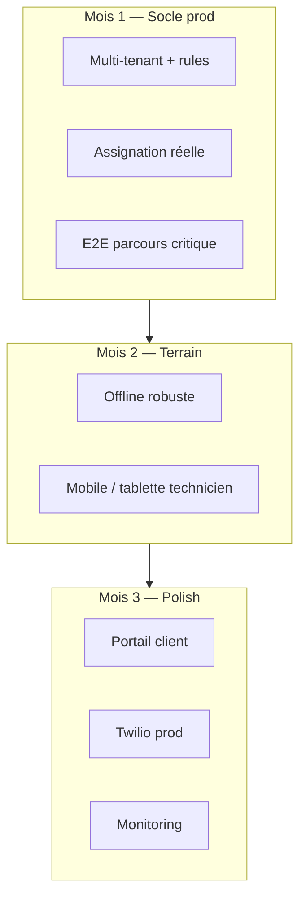

# Plan stratégique BELGMAP — exécution pas à pas

> **Objectif** : passer de prototype riche à PWA métier **production-ready** (multi-société, terrain fiable, déploiement Vercel).
>
> Documents liés : [CHANTIERS_COMPLEXES.md](./CHANTIERS_COMPLEXES.md) · [SETUP_VERCEL_GITHUB.md](./SETUP_VERCEL_GITHUB.md) · [CHECKLIST_PRODUCTION.md](./CHECKLIST_PRODUCTION.md)

---

## Vision (3 mois)



---

## Phase 0 — Prérequis (½ journée, une fois)

| Étape | Action | Validation |
|-------|--------|------------|
| 0.1 | Copier `.env.example` → `.env.local` | `npm run verify:env` OK (tier `staging`) |
| 0.2 | Firebase : projet, Auth (anonyme + téléphone), Firestore, Storage | Console accessible |
| 0.3 | Mapbox token public | Carte charge en dev |
| 0.4 | `npm run ci` local | lint + tests + build verts |
| 0.5 | Lire `AGENTS.md` + ce plan | — |

**Ne pas avancer la Phase 1 sans CI verte.**

---

## Phase 1 — Multi-tenant production (2–3 semaines)

> Référence détaillée : section 1 de [CHANTIERS_COMPLEXES.md](./CHANTIERS_COMPLEXES.md)

### Semaine 1 — Données et auth

| Jour | Tâche | Fichiers / commandes |
|------|-------|----------------------|
| 1.1 | Créer société test + membership admin | UI `CompanySpacePanel` ou Firestore manuel |
| 1.2 | Vérifier `POST /api/company/sync-claims` | `CompanyWorkspaceContext.refreshClaimsSilent` |
| 1.3 | Inviter collaborateur (`company_invites`) | `/api/company/accept-invite` |
| 1.4 | Vérifier token : `bmTenants` contient `companyId:admin` ou `:collaborateur` | Firebase Console → utilisateur → custom claims |
| 1.5 | Toutes les créations d’intervention avec `companyId` + `createdByUid` | `SmartInterventionRequestForm` |

**Test manuel 1.5** : collaborateur A ne voit pas les dossiers de société B (requête filtrée `where companyId ==`).

### Semaine 2 — Assignation techniciens réels

| Jour | Tâche | Détail |
|------|-------|--------|
| 2.1 | Renseigner `authUid` sur chaque doc `technicians/{id}` | UID Firebase Auth du compte terrain |
| 2.2 | `NEXT_PUBLIC_DEFAULT_ASSIGNED_TECHNICIAN_UID` en prod | Vercel → Environment Variables |
| 2.3 | Assigner via `TechnicianAssignPicker` | Vérifier `assignedTechnicianUid` = `authUid` choisi |
| 2.4 | Hub technicien : mission visible + carte | `useTechnicianAssignments` + `mapTechnicianMissions` |
| 2.5 | Acceptation / refus | `TechnicianAssignmentOfferCard` |

**Test Jest** : `IncomingClientRequestsPanel`, `technicianAssignmentsFilter`, `assignInterventionToTechnician`.

### Semaine 3 — Rules Firestore (durcissement)

| Jour | Tâche | Risque |
|------|-------|--------|
| 3.1 | Lire [FIRESTORE_PRODUCTION_MIGRATION.md](./FIRESTORE_PRODUCTION_MIGRATION.md) | — |
| 3.2 | Remplacer la règle « lecture globale hors portail » par lecture ciblée | **Régression dev** si mal testé |
| 3.3 | Déployer rules : `firebase deploy --only firestore:rules` | Staging d’abord |
| 3.4 | Activer `NEXT_PUBLIC_REAL_INTERVENTIONS_ONLY=true` sur Preview | Plus de mocks carte |

**Critère Phase 1 terminée** : checklist [CHECKLIST_PRODUCTION.md](./CHECKLIST_PRODUCTION.md) sections A + B cochées.

---

## Phase 2 — Parcours E2E et CI (1 semaine)

| Étape | Livrable |
|-------|----------|
| 2.1 | E2E `dashboard-load`, `dashboard-pager` (existant) | ✅ |
| 2.2 | E2E `technician-offline-panel` — panneau sync visible | `tests/e2e/technician-offline.spec.ts` |
| 2.3 | E2E smoke assignation (staging preview) | À étendre quand Firebase test dédié |
| 2.4 | `npm run release:check` avant chaque merge `main` | CI GitHub |

**Commande** : `npm run ci:all`

---

## Phase 3 — Offline terrain (1–2 semaines)

| Étape | Tâche | Fichier |
|-------|-------|---------|
| 3.1 | Comprendre file IndexedDB | `completionQueueDb.ts` |
| 3.2 | Tests conflit | `completionConflict.test.ts` (+ `completionSync` si ajouté) |
| 3.3 | UI file + conflits | `TechnicianOfflineSyncPanel`, `OfflineSyncContext` |
| 3.4 | Test terrain : mode avion → clôture → reconnect | Manuel |
| 3.5 | Documenter résolution conflit pour utilisateur | i18n `offline.conflict_*` |

**Règle métier** : si serveur `done` plus récent que file locale → **serveur gagne**, toast + badge UI.

---

## Phase 4 — Mobile / tablette technicien (2–3 semaines)

| Étape | Action |
|-------|--------|
| 4.1 | `NEXT_PUBLIC_ALLOW_MOBILE=true` sur staging | Débloque téléphones (`DesktopOnlyGate`) |
| 4.2 | Tester hub technicien sur iPhone / Android réel | Gestes, clavier, carte |
| 4.3 | Ajuster touch targets (min 44px), `TechnicianFinishJobPanel` | UX |
| 4.4 | Option : route `/m/technician` allégée (future) | Refonte si carousel insuffisant |

**Ne pas activer `ALLOW_MOBILE` en prod** tant que Phase 3 n’est pas validée.

---

## Phase 5 — Portail client (2 semaines)

| Étape | Tâche |
|-------|-------|
| 5.1 | `client_portal_profiles` + magic link |
| 5.2 | `RequesterTrackingPanel` aligné sur statuts réels |
| 5.3 | Chat IVANA : `portal_ivana_chat_messages` + rules |
| 5.4 | `NEXT_PUBLIC_CLIENT_PORTAL_DEFAULT_COMPANY_ID` |

---

## Phase 6 — Twilio + facturation + ops (continu)

| Étape | Doc |
|-------|-----|
| 6.1 | Webhooks Twilio prod | `SETUP_VERCEL_GITHUB.md` |
| 6.2 | Cloud Functions facture | `functions/src/invoiceAutomation.ts` |
| 6.3 | Smoke hebdo `PRODUCTION_URL` | `.github/workflows/release.yml` |
| 6.4 | Sentry / logs (optionnel) | — |

---

## Ordre d’exécution recommandé (agent autonome / nuit)

Si vous déléguez à un agent IA **sans clic utilisateur**, prioriser dans cet ordre :

1. **CI verte** — `npm run ci`
2. **Docs** — ce fichier, checklist prod, migration Firestore
3. **Code à faible risque** — `DesktopOnlyGate` + env, UI offline, tests unitaires
4. **E2E** — panneaux visibles sans auth Firebase réelle
5. **Ne pas** déployer rules Firestore strictes sans projet staging dédié
6. **Ne pas** committer `.env.local` ni secrets

### Livrables typiques d’une session autonome 8h

- [ ] `docs/PLAN_STRATEGIQUE.md` (ce fichier)
- [ ] `docs/CHECKLIST_PRODUCTION.md`
- [ ] `docs/FIRESTORE_PRODUCTION_MIGRATION.md`
- [ ] `NEXT_PUBLIC_ALLOW_MOBILE` + tests `DesktopOnlyGate`
- [ ] UI conflit offline + contexte enrichi
- [ ] E2E technician offline panel
- [ ] README mis à jour (liens docs)
- [ ] `npm run test:ci` + `npm run typecheck` verts

---

## Matrice risque / effort

| Tâche | Effort | Risque régression | Priorité |
|-------|--------|-------------------|----------|
| Assignation `authUid` | M | Faible | P0 |
| E2E smoke UI | M | Faible | P0 |
| UI offline conflit | S | Faible | P1 |
| ALLOW_MOBILE env | S | Moyen (UX téléphone) | P1 |
| Durcissement Firestore rules | L | **Élevé** | P0 prod seulement |
| Refonte mobile hub | XL | Élevé | P2 |
| Twilio prod | M | Moyen | P2 |

---

## Variables d’environnement par phase

| Phase | Variables |
|-------|-----------|
| Dev local | `NODE_ENV=development`, preview UI par défaut |
| Staging Vercel | `NEXT_PUBLIC_STAGING_PREVIEW=true`, `NEXT_PUBLIC_ALLOW_MOBILE=true` (test) |
| Production | `NEXT_PUBLIC_REAL_INTERVENTIONS_ONLY=true`, `NEXT_PUBLIC_PRESENTATION_PRIVACY_MODE=false`, `NEXT_PUBLIC_DEFAULT_ASSIGNED_TECHNICIAN_UID`, Firebase Admin sur Vercel |

---

## Commandes de référence

```bash
# Boucle dev
npm run dev

# Qualité complète
npm run ci
npm run ci:all          # + Playwright

# Env
npm run verify:env
npm run verify:env -- --tier=production

# Tests ciblés P0
npx jest src/features/interventions/__tests__/technicianSchedule --no-coverage
npx jest src/features/dispatch --no-coverage

# Deploy rules (staging Firebase project)
firebase deploy --only firestore:rules
```

---

## Glossaire rapide

| Terme | Signification |
|-------|----------------|
| **bmTenants** | Custom claim : `["companyId:admin", ...]` |
| **Tenant** | Société (`companyId`) isolée |
| **P0 métier** | Modules listés dans `AGENTS.md` (assignation, filtre, carte, schedule) |
| **Staging preview** | `NEXT_PUBLIC_STAGING_PREVIEW=true` — données démo sur Vercel |

---

## Travail « 8 heures » / autonome

Voir [TRAVAIL_AUTONOME.md](./TRAVAIL_AUTONOME.md) : ce que l’agent peut faire sans clic, limites, prompt type pour relancer une session.

## Historique des sessions

| Date | Session | Livrables |
|------|---------|-----------|
| 2026-05 | Nuit autonome | Plan stratégique, checklist prod, gate mobile, UI offline, E2E offline |
| 2026-05 | Suite autonome | TRAVAIL_AUTONOME.md, tests completionSync + TechnicianHubPage |
| 2026-05 | Phase 1 sem. 2 | authUid techniciens, script sync, E2E assign inbox, doc TECHNICIENS_AUTH_UID |

*Mettre à jour ce tableau après chaque grosse session.*
