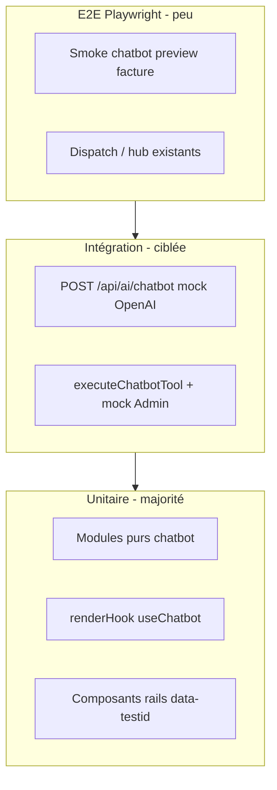

# Architecture de tests — CRMSLOT

Document de référence pour réduire les régressions et guider les agents (Cursor, Codex, etc.).  
Les règles opérationnelles restent dans [`AGENTS.md`](../AGENTS.md) ; ce fichier décrit **l’état actuel**, la **cible** et un **plan par phases**.

---

## 1. État actuel (juin 2026)

| Indicateur              | Valeur                                                                                                        |
| ----------------------- | ------------------------------------------------------------------------------------------------------------- |
| Suites Jest             | **~554** (~2 430 tests)                                                                                       |
| CI unitaire             | `npm run test:ci` (= typecheck + coverage) dans [`.github/workflows/test.yml`](../.github/workflows/test.yml) |
| E2E                     | **23** specs Playwright dans `tests/e2e/` (job séparé)                                                        |
| Seuils coverage globaux | ~45 % statements + **planchers par fichier P0** (dispatch, chatbot, portail client, facturation)              |
| Garde-fou agent         | `npm run test:agent-check` — typecheck + eslint + jest --findRelatedTests sur fichiers modifiés               |
| Mobile shell            | `npm run test:mobile-shell` — 15 suites / contrat `mobileShellContract.ts`                                    |

### CI

`npm run test:ci` doit rester **verte** avant tout merge. En cas d'échec : corriger en priorité (Phase 0).

### Ce qui fonctionne déjà bien

- **Jest + RTL + jsdom** via `next/jest`, mocks globaux dans [`jest.setup.ts`](../jest.setup.ts).
- **Tests colocalisés** `src/features/*/__tests__/`.
- **`render` / `mockState` / `factories`** : [`src/test-utils/`](../src/test-utils/).
- **P0 métier** : seuils stricts dispatch, chatbot executor/routing, facturation serveur, `RequesterHubContext`.
- **OAuth** : tests `crmStaffOAuthMode`, `gmailHubOAuthReturn`, `CrmStaffAuthEffects` (régression Gmail vs CRM).
- **Recettes agents** : [`docs/reference/AGENT_TEST_RECIPES.md`](../docs/reference/AGENT_TEST_RECIPES.md).
- **Ratchet coverage** : `npm run coverage:ratchet` — pas de baisse vs baseline `main`.

### Lacunes principales (priorité solo dev)

| Zone                  | Prochaine action                                                                      |
| --------------------- | ------------------------------------------------------------------------------------- |
| **E2E PR**            | Tiering smoke vs full nightly (Phase 20) — 23 specs sur chaque PR = lent              |
| **Contract API**      | Étendre `tests/contract/` à `/api/ai/chatbot`, `validate-report` (Phase 19)           |
| **Auth hooks**        | `useCrmStaffAccountPanel`, `useClientPortalAuthSignIn` — gros fichiers sans test hook |
| **Backoffice**        | `useBackOfficeInboxState.ts` (~287 L)                                                 |
| **Baseline coverage** | `npm run coverage:ratchet:update` après chaque palier de tests P1                     |

## 2. Pyramide cible



**Principe solo dev + agents** : maximiser les tests **rapides et déterministes** (pur + mocks). Réserver OpenAI / Firestore réel à quelques tests d’intégration et 1–2 E2E fumée.

---

## 3. Chatbot — carte du module

### 3.1 Fichiers source de vérité (ne pas éditer les copies)

| Rôle                      | Fichier                                                                                          |
| ------------------------- | ------------------------------------------------------------------------------------------------ |
| Outils (schéma)           | [`chatbot-tools.ts`](../src/features/chatbot/chatbot-tools.ts)                                   |
| Exécution outils          | [`chatbot-tool-executor.ts`](../src/features/chatbot/chatbot-tool-executor.ts)                   |
| OpenAI / messages         | [`chatbot-openai.ts`](../src/features/chatbot/chatbot-openai.ts)                                 |
| Route SSE                 | [`src/app/api/ai/chatbot/route.ts`](../src/app/api/ai/chatbot/route.ts)                          |
| Hook UI                   | [`hooks/useChatbot.ts`](../src/features/chatbot/hooks/useChatbot.ts)                             |
| Intent local (sans API)   | [`chatbot-local-intent.ts`](../src/features/chatbot/chatbot-local-intent.ts)                     |
| Désambiguïsation adresses | [`chatbot-address-disambiguation.ts`](../src/features/chatbot/chatbot-address-disambiguation.ts) |

**À supprimer ou ignorer** (dette) : tout fichier `* 2.ts`, `* 3.ts` dans `chatbot/` et `api/ai/chatbot/`.

### 3.2 Déjà testé (maintenir à chaque changement)

| Module                       | Fichier test                                                                     |
| ---------------------------- | -------------------------------------------------------------------------------- |
| Intent PWA / facture         | `chatbot-pwa-intent.test.ts`, `chatbot-local-intent.test.ts`                     |
| Choix « 1 / 2 / 3 » adresses | `chatbot-address-disambiguation.test.ts`                                         |
| Recherche workspace          | `chatbot-workspace-search.test.ts`                                               |
| Billing lignes / parse       | `chatbot-billing.test.ts`, `chatbot-billing-parse.test.ts`                       |
| Lecot / commandes            | `chatbot-lecot*.test.ts`, `chatbot-order-side-effect.test.ts`                    |
| Preview document             | `chatbot-document-side-effect.test.ts`                                           |
| Routing outils               | `chatbot-tool-routing.test.ts`                                                   |
| UI rails                     | `ChatbotRightRail`, `ChatbotSupplierOrdersPanel`, `ChatbotPdfPreviewPanel`, etc. |

Commande locale :

```bash
npx jest src/features/chatbot --no-coverage
```

### 3.3 Priorité tests manquants (chatbot P0)

#### A. `chatbot-tool-executor` — table-driven

Créer `src/features/chatbot/__tests__/chatbot-tool-executor.test.ts` :

- Mock **unique** `firebase-admin` (étendre `jest.setup.ts` si besoin : `get`, `where`, `batch`).
- Mock `sendInterventionEmail`, `orderLecotPartsForChatbot`.
- **1 test par outil** (ou regroupement logique) : entrée JSON → sortie typée / erreur.
- Cas obligatoires métier :
  - `search_workspace` — CRM + interventions, note « pas de fiche CRM »
  - `get_intervention_billing` / `update_intervention_billing`
  - `focus_intervention_document` (preview PDF)
  - `list_supplier_orders` / `order_lecot_parts`
  - refus cross-`companyId`

#### B. `useChatbot` — `renderHook`

Créer `src/features/chatbot/hooks/__tests__/useChatbot.test.ts` :

- Mocks : `fetchWithAuth`, `useWorkspaceCopilotSnapshot`, `useChatbotDocumentPreview`, `useChatbotSupplierOrdersPanel`.
- Scénarios :
  - message user → **POST `/api/ai/chatbot`** (OpenAI + outils) — plus de court-circuit `matchLocalChatbotIntent` côté envoi
  - réponse assistant « facture déjà créée » → ouverture preview (`shouldAutoPreviewInvoiceInPanel`)
  - persistance conversations `localStorage` (clé `belmap-chatbot-v2`)

Extraire si nécessaire des helpers purs de `useChatbot.ts` (ex. parsing stream) pour éviter un hook monolithique non testable.

#### C. Route API — fine couche

Option 1 (recommandée) : extraire la logique POST de `route.ts` vers `chatbot-route-handler.ts` (pur + injectable deps).

Option 2 : test supertest/undici sur la route avec mocks `runChatbotOpenAI` + `executeChatbotTool`.

Cas minimum :

- 401 sans auth
- 400 `companyId` manquant
- confirmTool → exécute un seul outil sans boucle OpenAI
- scope outils réduit (`inferChatbotToolScope`)

#### D. Fixture partagée agents

Créer `src/features/chatbot/testFixtures/chatbotWorkspaceSnapshot.ts` (hors `__tests__/` pour éviter que Jest l'exécute) :

- 2 interventions même client, adresses différentes (Vatsaev / Fourche / Lombardes)
- 1 client CRM, 1 intervention sans `clientId`
- Réutiliser dans intent, disambiguation, executor, hook.

### 3.4 Seuils coverage chatbot (après A+B)

Ajouter dans [`jest.config.ts`](../jest.config.ts) (ratchet progressif) :

```ts
'./src/features/chatbot/chatbot-local-intent.ts': { statements: 85, branches: 75, functions: 90, lines: 85 },
'./src/features/chatbot/chatbot-address-disambiguation.ts': { statements: 85, branches: 75, functions: 90, lines: 85 },
'./src/features/chatbot/chatbot-tool-executor.ts': { statements: 40, branches: 30, functions: 50, lines: 40 }, // monter par paliers
```

---

## 4. Règles pour agents IA (dont Codex — chatbot)

Lors d’une PR / tâche qui touche `src/features/chatbot/**` ou `src/app/api/ai/chatbot/**` :

1. **Ne jamais modifier** les fichiers `* 2.ts` / `* 3.ts` — uniquement les fichiers sans suffixe.
2. **Nouvel outil chatbot** = 4 livrables :
   - définition dans `chatbot-tools.ts`
   - `case` dans `chatbot-tool-executor.ts`
   - entrée dans `chatbot-tool-routing.ts` si scope dédié
   - test(s) : routing + executor (+ intent local si détection sans LLM)
3. **Commande de validation** :
   ```bash
   npx jest src/features/chatbot --no-coverage
   npm run typecheck
   ```
4. **Changement UI rail** : mettre à jour le test composant existant + `data-testid` stable.
5. **Pas d’appel OpenAI réel** en unitaire — mocker `runChatbotOpenAI` ou le `fetch` stream.
6. **Firebase** : mock global ; n’ajouter des mocks locaux que pour de nouveaux sous-modules Admin.

Snippet AGENTS.md à ajouter (optionnel) :

```markdown
### Chatbot (Codex / agents)

Voir `docs/agents/TESTING.md` §3. Après toute modif chatbot : `npx jest src/features/chatbot --no-coverage`.
```

---

## 5. Plan d’implémentation par phases

### Phase 0 — CI verte (0,5–1 j)

- [x] Corriger les 3 suites en échec (nav items, offline hub, lecot flags).
- [x] `npm run test:coverage` vert avec seuils chatbot (502 tests).

### Phase 1 — Hygiène chatbot (0,5 j)

- [x] Supprimer les doublons `* 2.ts` / `* 3.ts` (chatbot + API).
- [x] Ajouter `testFixtures/chatbotWorkspaceSnapshot.ts`.
- [x] Lier ce doc depuis `AGENTS.md` (1 paragraphe).

### Phase 2 — Executor + hook (2–3 j) **priorité Codex**

- [x] `chatbot-tool-executor.test.ts` (mocks Admin : 15 lectures + 8 écritures `userConfirmed`).
- [x] `useChatbot.test.ts` (localStorage, intent local, stream SSE, document-action, preview).
- [x] Seuils Jest chatbot P0 dans `jest.config.ts` (ratchet).

### Phase 3 — API route (1 j)

- [x] Handlers testables : `chatbot-route-handler.ts`, `chatbot-document-action-handler.ts`.
- [x] Tests : `chatbot-route-handler.test.ts`, `chatbot-document-action-handler.test.ts` (`@jest-environment node`).
- [x] Routes Next = wrappers minces (`app/api/ai/chatbot/*`).

### Phase 4 — E2E fumée chatbot (1 j)

- [x] `tests/e2e/chatbot-local-intent.spec.ts` : navigation Spotlight → chatbot, intent `résumé`, panneau PDF droit visible.
- [ ] E2E preview facture complète (nécessite société active + données) — optionnel.
- [ ] Garder le job E2E **optionnel** sur PR (label) si trop lent ; **obligatoire** sur `main` nightly.

### Phase 5 — Ratchet global (continu)

- [x] Planchers par fichier chatbot dans `jest.config.ts` (`chatbot-local-intent`, `address-disambiguation`, `route-handler`, `document-action-handler`, `tool-routing`, `tool-executor`).
- [x] Scripts npm : `test:chatbot`, `test:chatbot:coverage`, `test:e2e:chatbot`.
- [x] Workflow PR `.github/workflows/chatbot-tests.yml` (`npm run test:chatbot` si `src/features/chatbot/**` change).
- [ ] Remonter `coverageThreshold.global` par +2 % / trimestre (manuel).
- [ ] Planchers billing PDF / autres modules hors chatbot (à la demande).

### Phase 6 — PR template (15 min)

- [x] `.github/pull_request_template.md` : checklist tests + section chatbot/Codex.

### Phase 7 — Pipeline facturation (1–2 j)

- [x] `draftInvoiceBilling.test.ts` — templates, OpenAI mock, réutilisation lignes existantes.
- [x] `server/__tests__/prepareDraftBillingOnIntervention.test.ts`
- [x] `server/__tests__/validateInterventionReportServer.test.ts`
- [x] `server/__tests__/interventionInvoiceEmail.test.ts`
- [x] `server/__tests__/finalizeInterventionInvoiceAdmin.test.ts`
- [x] Seuils Jest : `draftInvoiceBilling`, `validateInterventionReportServer`, `interventionInvoiceEmail`.

### Phase 8 — CI interventions (½ j)

- [x] Script `npm run test:interventions`
- [x] Workflow `.github/workflows/interventions-tests.yml` (PR touchant `src/features/interventions/**`)
- [x] Règle agents §9 dans `AGENTS.md`

### Phase 9 — E2E fumée facturation

- [x] `tests/e2e/invoice-validation.spec.ts` — sécurité API + onglet Rapports IVANA.
- [x] `npm run test:e2e:invoice` — boucle locale (`npm run dev` + Firebase Admin).
- [x] `POST /api/e2e/seed-done-intervention` — seed dossier `done` (`e2e-invoice-validation`, dev uniquement).
- [x] Parcours intégré **serveur réel** : validation IVANA → `validate-report` → PDF + `invoiced` (Firebase Admin + Storage requis).
- [x] `data-testid` : `backoffice-inbox-tab-reports`, `backoffice-inbox-report-row-{id}`, `backoffice-inbox-verify-report`.
- Option manuelle : `E2E_DONE_INTERVENTION_ID=<id>` si pas de seed auto.

### Phase 10 — Ratchet global (continu)

- [ ] Remonter `coverageThreshold.global` par +2 % / trimestre.
- [ ] Planchers sur autres modules `server/` interventions au fil de l’eau.

### Phase 11 — Régressions mobile auth (CODEX mobile) ✅ 2026-06-13

Contexte : 7 erreurs HTTP 401 + Firestore `permission-denied` corrigées sur mobile (branch `cursor/mobile-corrections`). Cause racine : hooks et contextes déclenchaient des requêtes Firestore/API avant que l’auth Firebase soit résolue.

**Tests de régression ajoutés** :

| Fichier test                                                    | Ce qui est vérifié                                                                                                                                                       |
| --------------------------------------------------------------- | ------------------------------------------------------------------------------------------------------------------------------------------------------------------------ |
| `chatbot/hooks/__tests__/useChatbotSupplierOrdersPanel.test.ts` | Guard `firebaseUid === "anon"` et `null` — pwa-registry + Firestore non appelés                                                                                          |
| `dashboard/components/__tests__/MacroDroidIndicator.test.tsx`   | Auth gate : Firestore non souscrit avant auth ; affichage conditionnel selon `status`                                                                                    |
| `context/__tests__/CompanyWorkspaceContext.test.tsx`            | `authLoading` bloque l’exposition de `activeCompanyId` ; `demoTenantActive` désactivé pour user authentifié sans abonnements ; demo mode actif pour user non authentifié |

**Règles CODEX mobile** :

1. Tout hook qui souscrit Firestore ou appelle une API doit avoir un test pour le cas `firebaseUid = null / "anon"`.
2. `CompanyWorkspaceContext` : ne jamais enlever les gates `authLoading || !membershipsReady` — ils évitent les requêtes prématurées.
3. `demoTenantActive` ne doit pas s’activer pour un utilisateur authentifié — condition `!firebaseUid` obligatoire.
4. Tout composant avec `onAuthStateChanged` interne doit avoir un test avec `mockState.currentUser = null` (Firestore non appelé).

**Commande** :

```bash
npx jest src/context/__tests__/CompanyWorkspaceContext.test.tsx src/features/chatbot/hooks/__tests__/useChatbotSupplierOrdersPanel.test.ts src/features/dashboard/components/__tests__/MacroDroidIndicator.test.tsx --no-coverage
```

---

## 6. E2E existants (ne pas surcharger)

Parcours déjà couverts : dispatch, assignation dispatcher, hub technicien, pager dashboard, portail client, API health/security.

**Ne pas dupliquer** la logique métier en E2E : une seule assertion de bout en bout par flux chatbot ; le détail reste en unitaires.

---

## 7. Commandes utiles

| Action                   | Commande                                                                                |
| ------------------------ | --------------------------------------------------------------------------------------- |
| Tout le chatbot          | `npm run test:chatbot`                                                                  |
| Tout interventions       | `npm run test:interventions`                                                            |
| Chatbot + coverage       | `npm run test:chatbot:coverage` (seuils chatbot : lancer `npm run test:coverage` en CI) |
| E2E chatbot              | `npm run test:e2e:chatbot`                                                              |
| E2E facturation          | `npm run test:e2e:invoice`                                                              |
| E2E hub société          | `npm run test:e2e:company`                                                              |
| E2E clôture technicien   | `npm run test:e2e:technician`                                                           |
| E2E offline sync         | `npm run test:e2e:offline`                                                              |
| E2E matrice API auth     | `npm run test:e2e:api-matrix`                                                           |
| Matériel + catalogue     | `npm run test:feature-hub`                                                              |
| Gmail                    | `npm run test:gmail`                                                                    |
| CRM                      | `npm run test:crm`                                                                      |
| Billing hub              | `npm run test:billing-hub`                                                              |
| Webhooks                 | `npm run test:webhooks`                                                                 |
| Régénérer routes API     | `npm run generate:api-routes`                                                           |
| Un fichier               | `npx jest src/features/chatbot/__tests__/chatbot-local-intent.test.ts --no-coverage`    |
| CI locale                | `npm run test:ci`                                                                       |
| Coverage                 | `npm run test:coverage`                                                                 |
| E2E                      | `npm run test:e2e`                                                                      |
| CI complet               | `npm run ci` / `npm run ci:all`                                                         |
| Garde-fou agent (rapide) | `npm run test:agent-check` (typecheck + eslint + jest fichiers modifiés)                |
| Ratchet coverage         | `npm run coverage:ratchet` (échoue si baisse > 0.5pt vs baseline)                       |
| Mettre à jour baseline   | `npm run coverage:ratchet:update`                                                       |
| Lister fichiers < 50%    | `npm run coverage:uncovered`                                                            |
| Contract tests Zod       | `npm run test:contract`                                                                 |

---

## 7bis. Architecture agent-first (Phases 12-15, 2026-06-15)

Quatre phases ajoutées pour faciliter la maintenance par agents IA (Claude / Cursor / Codex) sans seuils stricts qui empêchent l'itération.

### Phase 12 — Garde-fous agent

- `scripts/agent-test-check.mjs` : typecheck + lint sur les fichiers modifiés + `jest --findRelatedTests`.
- `npm run test:agent-check` : à exécuter avant chaque push.
- `docs/reference/AGENT_TEST_RECIPES.md` : 10 patterns (pur, hook, context, UI, route API, workflow Firestore, bridge natif, outil chatbot, migration DB, régression bug fixé).
- **Règle d'or** : tout bug fixé → un test qui échoue sans le fix, avec commentaire `// Régression : <desc> — <YYYY-MM-DD>`.

### Phase 13 — Coverage ratchet (pas de baisse)

- `scripts/check-coverage-ratchet.mjs` : compare `coverage/coverage-summary.json` vs `coverage/baseline.json`.
- Échoue si une métrique d'un fichier baisse de plus de 0.5 pt vs baseline (tolérance arrondi V8).
- `.github/workflows/coverage-ratchet.yml` : récupère le baseline depuis `main` sur chaque PR.
- Commandes : `npm run coverage:ratchet`, `npm run coverage:ratchet:update`, `npm run coverage:uncovered`.
- **Pourquoi** : permet d'ajouter du code sans tests _temporairement_ tant qu'on ne casse rien d'existant — mais on ne peut jamais régresser sur les fichiers déjà couverts.

### Phase 14 — Contract tests Zod

- `src/core/api/schemas/` : source de vérité unique pour les contrats client/server (`notifications`, `interventions`, `auth`).
- `tests/contract/*.contract.test.ts` : valide schémas (entrée + sortie) avant que la route ne soit invoquée.
- `/api/notifications/send` consomme `SendNotificationRequestSchema.safeParse` → 400 + `issues` si KO.
- `npm run test:contract` : tourne les contrats rapidement.
- **Prochaines routes à couvrir** : `/api/interventions/[id]/validate-report`, `/api/ai/chatbot`.

### Phase 15 — Bridges natifs Capacitor en injection de deps

- Pattern : chaque fonction expose un `deps` paramètre optionnel (prod par défaut, stubs en test).
- `nativeDocumentSave` : `SaveOrShareDeps { isNative, loadFilesystem, loadShare, webDownload }`.
- `nativeGeolocation` : `NativeGeolocationDeps { isNative, loadPlugin: () => GeolocationPlugin }`.
- `nativePushClickHandler` : `NativePushClickHandlerDeps { isNative, loadPlugin, dispatch }`.
- **Avantage** : pas besoin de `jest.mock("@capacitor/foo")` qui crashe en jsdom — les tests passent des objets typés directement.
- Voir `docs/reference/AGENT_TEST_RECIPES.md` §7 pour le pattern complet.

---

## 8. Definition of Done (feature + agent)

Une tâche est **terminée** quand :

1. `npm run typecheck` passe.
2. `npm run test:ci` passe (ou au minimum les suites touchées + `test:chatbot` / `test:interventions` si concerné).
3. Tout nouveau module **pur** dans `src/features/*` a un test colocalisé.
4. Tout nouveau **outil chatbot** a un test executor (+ routing).
5. Tout flux **interventions / facturation** serveur a un test dans `server/__tests__/`.
6. Tout composant interactif nouveau a un `data-testid` + test RTL si logique non triviale.

---

_Dernière mise à jour : généré pour la demande « architecture tests + focus chatbot / agents »._
